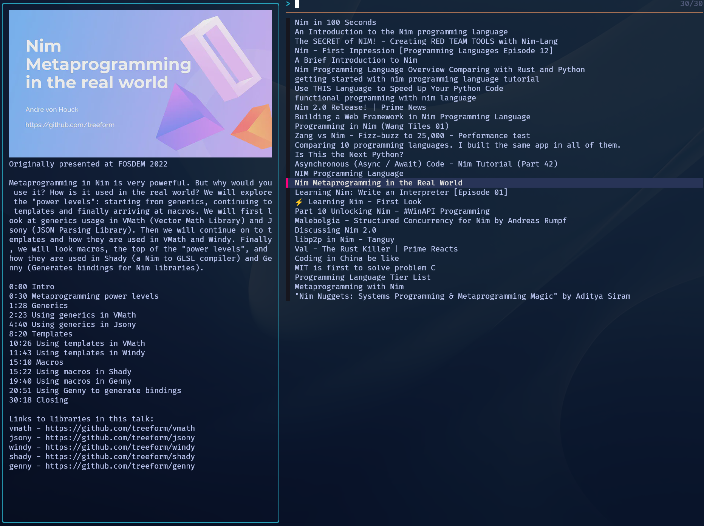

# YTT

This small bash script provides a convenient way to browse and watch videos from YouTube.
At the moment it requires the Kitty terminal for image previews.

## Features

- **Minimalist Design**: Tiny, hackable source code that's easy to customize.
- **Personalized Feed**: Fetches your YouTube recommendations when run without arguments.
- **Search Functionality**: Performs a YouTube search when keywords are provided as arguments.
- **Rich Preview**: Displays video thumbnails and descriptions for easy browsing.
- **Interactive Navigation**: Utilizes fzf for smooth, keyboard-driven selection.
- **Instant Playback**: Plays selected videos using mpv for a seamless viewing experience.



## Prerequisites

Ensure you have the following tools installed:

- [yt-dlp](https://github.com/yt-dlp/yt-dlp): YouTube video downloader
- [jq](https://stedolan.github.io/jq/): Lightweight command-line JSON processor
- [fzf](https://github.com/junegunn/fzf): Command-line fuzzy finder
- [kitty](https://sw.kovidgoyal.net/kitty/): GPU-based terminal emulator (required for image preview)
- [mpv](https://mpv.io/): Versatile media player
- curl: Command-line tool for transferring data
- base64: Base64 encoding/decoding utility

Additionally:
- Firefox: Must be installed and logged into your YouTube account for accessing personalized content.

## Installation

```shell
git clone https://github.com/eterps/ytt.git
chmod +x ytt/ytt
cp ytt/ytt ~/.local/bin
```
## Customization

YTT is designed to be easily customizable:

- Adjust the number of fetched videos: Modify `-I 1:30` in `get_yt_feed` function.
- Change video quality: Edit the `opts` variable in the `main` function.
- Customize preview window: Modify `--preview-window` option in the `main` function.

## License

This project is open source and available under the [MIT License](LICENSE).

## Acknowledgements

This script draws inspiration from [magic-tape](https://gitlab.com/christosangel/magic-tape) by Christos Angelopoulos. If you're looking for a feature-rich alternative with an advanced fzf-based UI, magic-tape is an excellent choice.
